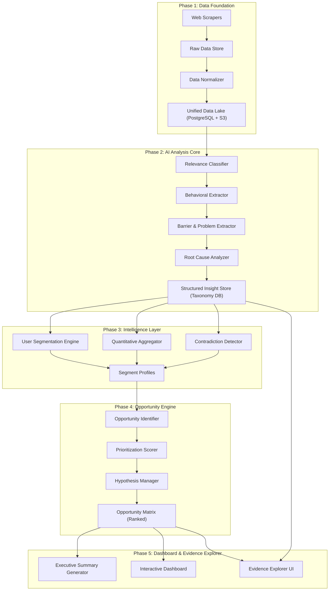
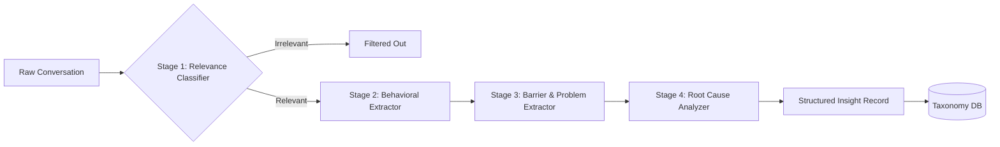
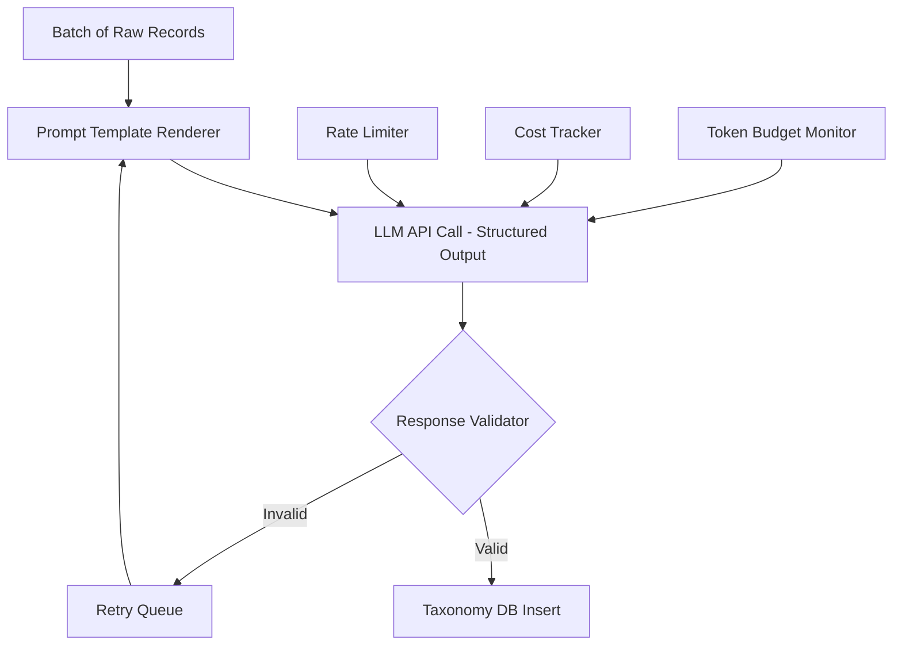
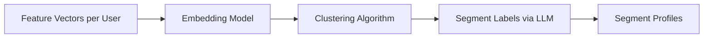
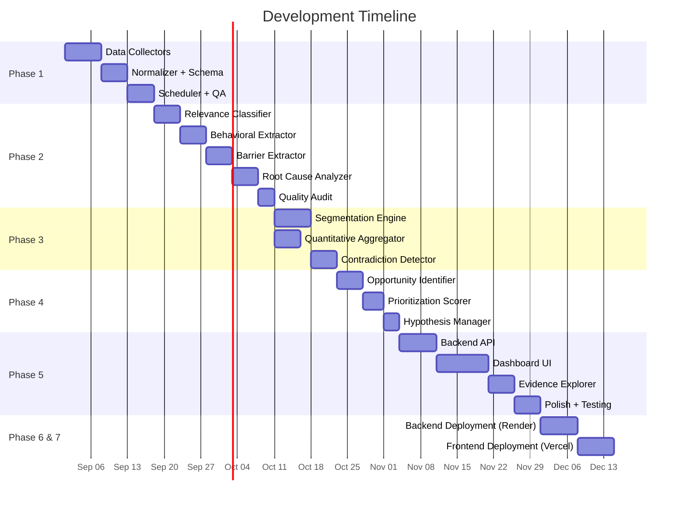

# Phase-Wise Architecture: AI-Powered Myntra Wishlist Discovery Engine

## Goal

Design a phase-wise system architecture for an AI-powered discovery engine that analyzes public user conversations at scale to identify why wishlisted fashion products are not purchased — ultimately improving Myntra's **30-day wishlist-to-purchase conversion rate**.

The architecture is split into **5 development phases**, each building on the previous one, progressing from raw data collection to a fully interactive, evidence-backed opportunity explorer.

---

## High-Level Architecture Overview



---

## Phase 1: Data Foundation

**Objective:** Build the data collection, ingestion, and normalization infrastructure to gather public user conversations from multiple platforms.

**Duration estimate:** 2–3 weeks

---

### Components

#### 1.1 Data Collectors (Scrapers / API Integrators)

| Source | Method | Data Captured |
|---|---|---|
| Google Play Store | `google-play-scraper` (npm/Python) | App reviews, ratings, dates, usernames |
| Apple App Store | `app-store-scraper` | App reviews, ratings, dates |
| Reddit | Reddit API (PRAW) / Pushshift | Posts + comments from r/IndianFashionAddicts, r/Myntra, r/FashionIndia, etc. |
| YouTube | YouTube Data API v3 | Comments on Myntra haul/review videos |
| Product Reviews | Web scraping (Scrapy/Playwright) | Myntra, AJIO product reviews + Q&A |
| Fashion Forums | Web scraping | Threads from fashion communities |

Each collector outputs a **standardized raw record**:

```json
{
  "source_id": "uuid",
  "platform": "google_play | reddit | youtube | ...",
  "source_url": "https://...",
  "author": "anonymized_hash",
  "date": "2026-01-15T10:30:00Z",
  "content": "Original user text...",
  "rating": 3,
  "metadata": {
    "subreddit": "IndianFashionAddicts",
    "product_id": null,
    "parent_thread": null
  }
}
```

#### 1.2 Raw Data Store

| Aspect | Choice |
|---|---|
| Storage | PostgreSQL (structured metadata) + S3/MinIO (raw text blobs) |
| Deduplication | Content hash-based dedup at ingestion |
| Scheduling | Airflow / Prefect DAGs for periodic collection |
| Volume Target | 50,000–200,000 records in initial sweep |

#### 1.3 Data Normalizer

- Cleans HTML, emojis, and encoding artifacts
- Standardizes date formats to ISO 8601
- Anonymizes author identifiers
- Detects and tags language (prioritize English and Hindi-English)
- Splits compound reviews into individual statements where meaningful

#### 1.4 Unified Data Lake Schema

```
raw_conversations
├── id (UUID, PK)
├── platform (ENUM)
├── source_url (TEXT)
├── author_hash (TEXT)
├── content (TEXT)
├── content_clean (TEXT)
├── language (VARCHAR)
├── date (TIMESTAMP)
├── rating (INT, nullable)
├── metadata (JSONB)
├── content_hash (VARCHAR, UNIQUE)
├── created_at (TIMESTAMP)
└── is_processed (BOOLEAN)
```

### Phase 1 Output

- A populated, deduplicated data lake with 50K–200K raw conversations
- Scheduler running periodic collection jobs
- Data quality dashboard (row counts, source distribution, date coverage)

---

## Phase 2: AI Analysis Core

**Objective:** Build the multi-stage LLM-powered analysis pipeline that transforms raw conversations into structured behavioral insights following the Discovery Taxonomy.

**Duration estimate:** 3–4 weeks

---

### Architecture



### Components

#### 2.1 Stage 1 — Relevance Classifier

**Purpose:** Filter the dataset to only fashion-shopping-relevant conversations, with emphasis on wishlist-to-purchase journey signals.

**Implementation:**
- **Model:** Fine-tuned classifier OR LLM zero-shot/few-shot prompt
- **Labels:** `relevant` | `partially_relevant` | `irrelevant`
- **Relevance criteria:** Mentions of online fashion shopping, wishlist/save behavior, product consideration, purchase hesitation, purchase decisions, product comparison, pre-purchase research, fashion-shopping uncertainty
- **Target:** Keep only `relevant` and `partially_relevant` records

**Key Design Decision:**
- Use a lightweight classifier (e.g., fine-tuned `distilbert`) for initial bulk filtering
- Use LLM (GPT-4o / Gemini) for borderline cases

#### 2.2 Stage 2 — Behavioral Extractor

**Purpose:** Identify what the user is actually *doing* in the conversation.

**Output per record:**

```json
{
  "behaviors": [
    {
      "behavior": "comparing_products",
      "shopping_stage": "comparison_research",
      "wishlist_mention": true,
      "fashion_category": "western_wear",
      "purchase_status": "not_purchased",
      "evidence_quote": "I added 5 kurtis to my wishlist and kept going back..."
    }
  ]
}
```

**Behavior taxonomy** (extensible):
`browsing`, `saving/wishlisting`, `revisiting`, `delaying`, `comparing`, `searching_reviews`, `searching_externally`, `asking_friends`, `waiting_for_occasion`, `switching_products`, `abandoning`, `purchasing`

#### 2.3 Stage 3 — Barrier & Problem Extractor

**Purpose:** Extract the *why* — what prevents or delays the desired purchase behavior.

**Output per record:**

```json
{
  "barriers": [
    {
      "purchase_barrier": "size_fit_uncertainty",
      "uncertainty": "Will this fit me correctly?",
      "user_need": "Reliable size guidance for this specific brand",
      "user_workaround": "Reading 50+ reviews to find similar body type",
      "external_platform": "YouTube",
      "comparison_behavior": "Comparing Myntra reviews with AJIO reviews",
      "decision_factor": "Consistent positive reviews on fit"
    }
  ]
}
```

**Multi-level extraction (critical):**

| Level | Example |
|---|---|
| Surface statement | "I read many reviews because I am not sure about the size" |
| Surface behavior | Reading reviews |
| Uncertainty | Size/fit confidence |
| Potential barrier | Low confidence in expected fit |
| Workaround | Review research |
| Root cause (Stage 4) | Insufficient brand-specific sizing information on product page |

#### 2.4 Stage 4 — Root Cause Analyzer

**Purpose:** Chain surface observations into root cause hierarchies.

**Analytical framework:**

```
Symptom → Behavior → Barrier → Underlying Uncertainty → Root Cause
```

**Implementation:**
- LLM chain-of-thought prompting with the framework above
- Cross-reference multiple records to identify recurring root cause patterns
- Assign initial `evidence_strength` and `confidence` scores

#### 2.5 Structured Insight Store (Taxonomy DB)

Every processed record produces a row in the **Discovery Taxonomy Table**:

```
analyzed_insights
├── id (UUID, PK)
├── conversation_id (FK → raw_conversations)
├── source / platform / date (denormalized)
├── original_comment (TEXT)
├── relevance (ENUM: high, medium, low)
├── fashion_category (VARCHAR)
├── shopping_stage (ENUM)
├── wishlist_mention (BOOLEAN)
├── intent_type (VARCHAR)
├── purchase_status (ENUM)
├── purchase_barrier (VARCHAR[])
├── uncertainty (TEXT[])
├── user_need (TEXT[])
├── user_workaround (TEXT[])
├── external_platform_mention (VARCHAR[])
├── comparison_behavior (TEXT)
├── decision_factor (TEXT[])
├── user_segment (VARCHAR[])
├── root_cause (TEXT[])
├── opportunity_area (VARCHAR[])
├── evidence_strength (ENUM: strong, moderate, weak)
├── confidence (FLOAT)
├── llm_model_used (VARCHAR)
├── processing_timestamp (TIMESTAMP)
└── is_observed_vs_inferred (ENUM)
```

### LLM Pipeline Design



**Key design choices:**
- **Batch processing:** Process records in batches of 5-10 per LLM call for cost efficiency
- **Structured output:** Use JSON mode / function calling for reliable extraction
- **Retry with backoff:** Handle rate limits and transient failures
- **Human-in-the-loop validation:** Random sample 5% of outputs for quality audit
- **Model selection:** GPT-4o for complex extraction, GPT-4o-mini for bulk relevance filtering

### Phase 2 Output

- Fully populated Taxonomy DB with structured insight records
- Processing metrics: records analyzed, acceptance rate, per-stage metrics
- Quality audit report (precision/recall of relevance classifier, extraction accuracy)

---

## Phase 3: Intelligence Layer

**Objective:** Aggregate individual insights into patterns — user segments, quantitative distributions, and contradiction detection.

**Duration estimate:** 2–3 weeks

---

### Components

#### 3.1 User Segmentation Engine

**Purpose:** Cluster users into meaningful behavioral segments based on extracted evidence.

**Approach:**



**Segmentation dimensions** (evidence-driven, not arbitrary):
- Shopping frequency signals
- Fashion involvement level
- Purchase intent strength
- Primary product categories
- Dominant purchase barriers
- Reliance on external research
- Comparison intensity
- Decision confidence level

**Implementation:**
- Create per-author feature vectors from extracted insights
- Use embedding-based clustering (UMAP + HDBSCAN) for initial discovery
- Use LLM to generate descriptive segment labels
- Validate segments against evidence (minimum support threshold)

**Segment output schema:**

```json
{
  "segment_id": "high_intent_fit_uncertain",
  "segment_name": "High-Intent, Fit-Uncertain Shoppers",
  "description": "Users with strong purchase intent who delay due to sizing uncertainty",
  "size": 342,
  "percentage": 18.5,
  "dominant_barriers": ["size_fit", "quality_uncertainty"],
  "dominant_behaviors": ["extensive_review_reading", "external_research"],
  "representative_quotes": ["...", "..."],
  "evidence_strength": "strong"
}
```

#### 3.2 Quantitative Aggregator

**Purpose:** Compute all quantitative metrics required by Section 8 of the problem statement.

**Metrics computed:**

| Metric | SQL/Code Logic |
|---|---|
| Total conversations analyzed | `COUNT(*)` from raw_conversations |
| Relevant conversations | `COUNT(*)` WHERE relevance IN ('high','medium') |
| Intent type frequency | `GROUP BY intent_type`, `COUNT(*)`, `percentage` |
| Purchase barrier frequency | Unnest arrays, `GROUP BY`, `COUNT(*)` |
| Uncertainty frequency | Unnest arrays, `GROUP BY`, `COUNT(*)` |
| External research frequency | `COUNT(*)` WHERE external_platform IS NOT NULL |
| Comparison behavior frequency | `COUNT(*)` WHERE comparison_behavior IS NOT NULL |
| Segment prevalence | From segmentation output |
| Barrier co-occurrence | Pairwise co-occurrence matrix |
| Trend over time | `GROUP BY date_trunc('month', date)` |

**Critical rule:** Every metric must include:
- Numerator
- Denominator
- Sample size
- Time period (where relevant)

**Output:** Stored in `quantitative_metrics` table + materialized views for dashboarding.

#### 3.3 Contradiction Detector

**Purpose:** Actively surface conflicting evidence (Section 12 requirement).

**Implementation:**
- For each major insight/barrier, query for records that explicitly contradict it
- Use LLM to classify evidence as `supporting`, `contradicting`, or `neutral`
- Compute a **contradiction ratio** for each major finding

**Output per insight:**

```json
{
  "insight": "Size/fit is a major purchase barrier",
  "supporting_count": 245,
  "contradicting_count": 32,
  "contradiction_ratio": 0.12,
  "contradicting_examples": ["I never worry about size, I just order and return...", "..."],
  "confidence_adjusted": 0.82
}
```

### Phase 3 Output

- Segment profiles with evidence backing
- Full quantitative metrics dashboard data
- Contradiction reports for all major findings
- Co-occurrence matrices for barriers and intents

---

## Phase 4: Opportunity Engine

**Objective:** Convert validated patterns into scored, ranked opportunity areas with hypothesis management.

**Duration estimate:** 2 weeks

---

### Components

#### 4.1 Opportunity Identifier

**Purpose:** Synthesize recurring problems and unmet needs into discrete opportunity areas.

**Process:**
1. Cluster related root causes, barriers, and unmet needs
2. Generate opportunity names and descriptions
3. Map each opportunity to the wishlist-to-purchase journey stage

**Opportunity schema:**

```json
{
  "opportunity_id": "opp_001",
  "opportunity_name": "Brand-Specific Fit Confidence",
  "user_need": "Users need reliable, brand-specific sizing guidance",
  "affected_segments": ["high_intent_fit_uncertain", "first_time_brand_buyers"],
  "journey_stage": ["product_re_evaluation", "purchase_confidence"],
  "evidence_count": 245,
  "frequency_score": 8.2,
  "severity_score": 7.5,
  "purchase_relevance_score": 9.0,
  "intent_relevance_score": 8.5,
  "workaround_effort_score": 7.0,
  "product_leverage_score": 8.0,
  "evidence_strength_score": 8.5,
  "overall_opportunity_score": 8.1,
  "existing_workarounds": ["Reading 50+ reviews", "YouTube try-on hauls", "Ordering multiple sizes"],
  "supporting_evidence_ids": ["uuid1", "uuid2", "..."],
  "contradicting_evidence_ids": ["uuid3"],
  "leading_behavioral_metric": "Review read depth before add-to-cart",
  "confidence": 0.85,
  "hypothesis_level": "ai_generated"
}
```

#### 4.2 Prioritization Scorer

**Purpose:** Rank opportunities using the 7-dimension framework from Section 9.

**Scoring formula (weighted):**

```
Overall Score = w1 × Frequency + w2 × Severity + w3 × Purchase_Relevance
             + w4 × Intent_Relevance + w5 × Workaround_Effort
             + w6 × Product_Leverage + w7 × Evidence_Strength
```

Default weights (configurable):

| Dimension | Weight | Rationale |
|---|---|---|
| Frequency | 0.15 | How often the problem appears |
| Severity | 0.15 | Impact on user experience |
| Purchase Relevance | 0.20 | Direct connection to wishlist→purchase |
| Intent Relevance | 0.15 | Occurs among high-intent users |
| Workaround Effort | 0.10 | User effort to solve today |
| Product Leverage | 0.10 | Myntra's ability to address |
| Evidence Strength | 0.15 | Quality of supporting data |

#### 4.3 Hypothesis Manager

**Purpose:** Track the knowledge level of each finding per Section 13.

| Level | Label | Criteria |
|---|---|---|
| Level 1 | Industry Hypothesis | Known from general industry understanding, not yet verified in this dataset |
| Level 2 | AI-Generated Hypothesis | Pattern identified from analyzed data, not yet validated with primary research |
| Level 3 | Validated Finding | Confirmed or challenged through primary user research |

**Rules:**
- All discoveries from this engine start at **Level 1 or Level 2**
- The engine must **never** label an AI-generated pattern as Level 3
- Each hypothesis tracks: creation date, evidence updates, confidence trajectory

#### 4.4 Journey Stage Mapper

Maps each opportunity to the wishlist-to-purchase funnel:

```
Wishlist Added → Wishlist Revisit → Product Re-evaluation
→ Purchase Confidence → Add to Cart → Purchase
```

Identifies which funnel stages have the highest concentration of friction.

### Phase 4 Output

- Ranked Opportunity Matrix (the core deliverable)
- Hypothesis registry with levels and confidence
- Journey-stage friction map
- Configurable scoring weights

---

## Phase 5: Dashboard & Evidence Explorer

**Objective:** Build the interactive frontend that surfaces all outputs (Section 10) and enables drill-down from opportunity → theme → segment → evidence → original source.

**Duration estimate:** 3–4 weeks

---

### Architecture

```mermaid
graph TB
    subgraph "Frontend (Next.js / React)"
        F1[Executive Summary View]
        F2[Opportunity Matrix View]
        F3[Segment Analysis View]
        F4[Journey Friction Map]
        F5[Evidence Explorer]
        F6[Quantitative Dashboard]
        F7[Contradiction Report]
    end

    subgraph "Backend API (FastAPI / Python)"
        API1[/api/summary]
        API2[/api/opportunities]
        API3[/api/segments]
        API4[/api/evidence]
        API5[/api/metrics]
        API6[/api/journey]
        API7[/api/contradictions]
        API8[/api/filters]
    end

    subgraph "Data Layer"
        DB1[(Taxonomy DB)]
        DB2[(Opportunity Store)]
        DB3[(Metrics Cache)]
    end

    F1 --> API1
    F2 --> API2
    F3 --> API3
    F5 --> API4
    F6 --> API5
    F4 --> API6
    F7 --> API7

    API1 --> DB1
    API2 --> DB2
    API3 --> DB1
    API4 --> DB1
    API5 --> DB3
    API6 --> DB2
    API7 --> DB1
```

### Dashboard Views (Mapping to Section 10 Outputs)

#### View 1: Executive Summary (Output 1)
- High-level cards: Total conversations, relevant conversations, segments discovered, opportunities identified
- Top 5 wishlist intent types (bar chart)
- Top 5 purchase barriers (bar chart)
- Top 3 opportunity areas (cards with scores)
- Key hypothesis alerts (Level 1 vs Level 2 callouts)

#### View 2: Wishlist Intent Taxonomy (Output 2)
- Interactive treemap or sunburst chart of intent types
- Each intent type shows: frequency, representative quotes, associated segments

#### View 3: Purchase Barrier Landscape (Output 3)
- Barrier frequency heatmap
- Barrier co-occurrence network graph
- Filter by segment, category, shopping stage

#### View 4: Uncertainty Map (Output 4)
- What information users still need before purchasing
- Grouped by uncertainty type, ranked by frequency
- Linked to workarounds (View 5)

#### View 5: Workaround Map (Output 5)
- How users currently solve their uncertainties
- Effort score per workaround
- Links to opportunities that could reduce workaround effort

#### View 6: External Research Map (Output 6)
- Sankey diagram: User need → External platform → Information sought
- Platform breakdown: Reddit, YouTube, Instagram, Google, friends, etc.

#### View 7: Segment Analysis (Output 7)
- Segment comparison table
- Per-segment: dominant barriers, intents, behaviors, workarounds
- Segment-specific opportunity ranking

#### View 8: Opportunity Matrix (Output 8)
- Sortable/filterable table with all 7 scoring dimensions
- Radar charts for individual opportunities
- Side-by-side comparison mode
- Journey stage overlay

#### View 9: Evidence Explorer (Output 9)
- **Drill-down path:** Opportunity → Theme → Segment → Evidence → Original source
- Full-text search across evidence
- Filter by: source, segment, category, barrier, intent, shopping stage, confidence
- Each evidence item shows: original quote, extracted fields, observed vs. inferred flag, confidence

### Filtering & Interaction

Global filters available across all views:

| Filter | Options |
|---|---|
| Platform/Source | Google Play, Reddit, YouTube, AJIO, etc. |
| User Segment | All discovered segments |
| Fashion Category | Western, Ethnic, Footwear, Accessories, etc. |
| Purchase Barrier | All discovered barriers |
| Intent Type | All discovered intents |
| Shopping Stage | Discovery → Post-Purchase |
| Evidence Strength | Strong, Moderate, Weak |
| Hypothesis Level | Industry, AI-Generated, Validated |
| Date Range | Time-based filtering |

### Phase 5 Output

- Fully interactive dashboard with all 9 required output views
- Evidence traceability from opportunity down to original source
- Export capabilities (CSV, PDF reports)
- Shareable URLs for specific views/filters

---

## Phase 6: Backend Deployment (Render)

**Objective:** Deploy the FastAPI backend logic to a cloud environment, ensuring it can securely serve data to the frontend while reading from static databases/JSON files.

**Duration estimate:** 1 week

### Components
- **Hosting Platform:** Render (Free Web Service Tier)
- **Deployment Strategy:** GitHub integration with automatic build on push
- **Environment Setup:** `requirements.txt` for dependencies, `uvicorn` as the ASGI server
- **CORS Configuration:** Restricting access to the deployed frontend domain to maintain security

### Phase 6 Output
- Live, publicly accessible REST API (HTTPS) serving all endpoints required by the dashboard.

---

## Phase 7: Frontend Deployment (Vercel)

**Objective:** Deploy the React/Vite dashboard to a global CDN for high-performance delivery.

**Duration estimate:** 1 week

### Components
- **Hosting Platform:** Vercel (Free Tier)
- **Deployment Strategy:** GitHub integration with Vite build preset (`npm run build`)
- **Environment Variables:** Connecting the frontend to the live Render API URL instead of `localhost`
- **Routing:** SPA routing configuration to handle client-side navigation seamlessly

### Phase 7 Output
- Live, globally accessible web dashboard providing stakeholders with interactive access to the intelligence engine.

---

## Technology Stack Summary

| Layer | Technology |
|---|---|
| **Data Collection** | Python (Scrapy, Playwright, PRAW, google-play-scraper) |
| **Orchestration** | Airflow / Prefect |
| **Database** | PostgreSQL (primary) + Redis (caching) |
| **Object Storage** | S3 / MinIO (raw data blobs) |
| **LLM APIs** | OpenAI GPT-4o, GPT-4o-mini (or Gemini 2.5 Pro) |
| **ML/Clustering** | Python (scikit-learn, UMAP, HDBSCAN) |
| **Embeddings** | OpenAI text-embedding-3-small / Gemini embeddings |
| **Backend API** | FastAPI (Python) |
| **Frontend** | Next.js / React + Recharts / D3.js |
| **Deployment** | Docker Compose (dev), Cloud Run / ECS (prod) |
| **CI/CD** | GitHub Actions |

---

## Phase Summary & Dependencies



| Phase | Duration | Input | Output |
|---|---|---|---|
| **Phase 1: Data Foundation** | 2–3 weeks | Public data sources | Clean, normalized data lake (50K–200K records) |
| **Phase 2: AI Analysis Core** | 3–4 weeks | Raw conversations | Structured insight records (Taxonomy DB) |
| **Phase 3: Intelligence Layer** | 2–3 weeks | Insight records | Segments, metrics, contradiction reports |
| **Phase 4: Opportunity Engine** | 2 weeks | Aggregated patterns | Ranked opportunity matrix + hypotheses |
| **Phase 5: Dashboard & Explorer** | 3–4 weeks | All processed data | Interactive 9-view dashboard |
| **Phase 6: Backend Deployment** | 1 week | FastAPI Backend | Live Render API |
| **Phase 7: Frontend Deployment** | 1 week | React Frontend | Live Vercel Dashboard |
| **Total** | **~14–18 weeks** | | |
